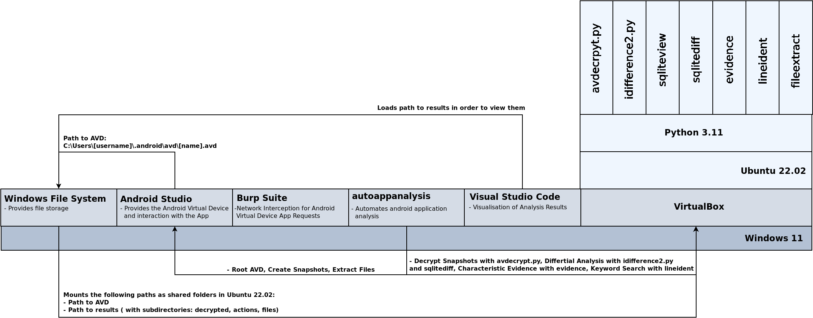

# Description

Setup for Analysis of Android Applications

# Architecture

---

## Windows 11 Host
  - Programs:
    - [VirtualBox](https://www.virtualbox.org/)
    - [Android Studio](https://developer.android.com/studio/)
    - [Burp Suite Community Edition](https://portswigger.net/burp/communitydownload)
    - [Visual Studio Code](https://code.visualstudio.com/)
    - [autoappanalysis](https://github.com/5f0ne/autoappanalysis)
  
   

  - Setup Host:
    - Add VboxManage to PATH
      - `C:\Program Files\Oracle\VirtualBox`
    - Add adb and emulator to PATH
      - `C:\Users\[username]\AppData\Local\Android\Sdk\platform-tools`
      - `C:\Users\[username]\AppData\Local\Android\Sdk\emulator`
    - Add the created AVD folder as a shared folder to your VM:
      - `C:\Users\[username]\.android\avd\[name].avd`
    - Add a shared folder for your analysis results:
      - Add subdirectory `decrypted`
        - Contains decrypted system images: `*.raw`
      - Add subdirectory `files`
        - Contains a folder for each snapshot with extracted files 
      - Add subdirectory `actions`
        - Contains a folder for each action with analysis results
  
   

  - Setup autoappanalysis:
    - In order to setup the Automation GUI correctly, follow the instructions of [autoappanalysis](https://github.com/5f0ne/autoappanalysis)
---

## Ubuntu 22.02 VM:

  - Programs:
    - [avdecrypt.py](https://faui1-gitlab.cs.fau.de/gaston.pugliese/avdecrypt)
      - Removes full disk encryption from AVD snapshots
    - [idifference2.py](https://github.com/dfxml-working-group/dfxml_python)
      - Differential analysis of file systems
    - [evidence](https://github.com/5f0ne/evidence)
      - Differential analysis of idifference2.py output
    - [sqliteview](https://github.com/5f0ne/sqliteview)
      - Visualizes SQLite files
    - [sqlitediff](https://github.com/5f0ne/sqlitediff)
      - Differential analysis of SQLite files
    - [lineident](https://github.com/5f0ne/lineident)
      - Searches files line by line for given words
    - [fileextract](https://github.com/5f0ne/fileextract)
      - Extractes files from .raw files using sleuthkit
  - Setup:
    - In order to setup the VM correctly, follow the instructions of [app-analysis-setup](https://github.com/5f0ne/app-analysis-setup)

---

# License

MIT