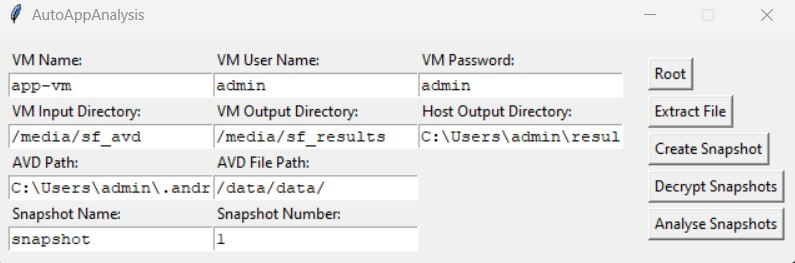

# Description

Setup for Analysis of Android Applications

---

## Windows 11 Host
  - Programs:
    - [VirtualBox](https://www.virtualbox.org/)
    - [Android Studio](https://developer.android.com/studio/)
    - [Burp Suite Community Edition](https://portswigger.net/burp/communitydownload)
    - [autoappanalysis](https://github.com/5f0ne/autoappanalysis)
  
  <br>

  - Setup Host:
    - Add VboxManage to PATH
      - `C:\Program Files\Oracle\VirtualBox`
    - Add adb to PATH
      - `C:\Users\[username]\AppData\Local\Android\Sdk\platform-tools`
    - Add the created AVD folder as a shared folder to your VM:
      - `C:\Users\[username]\.android\avd\[name].avd`
    - Add a shared folder for your analysis results:
      - Add subdirectory `decrypted`
      - Add subdirectory `ge`
      - Add subdirectory `sqlitediff`
  
  <br>

  - Setup autoappanalysis:
    - `pip install autoappanalysis`
    - Create config file:
    ```json
    // config.json
    {
      "vm": "app-vm",                                             // Name of the VM
      "user": "admin",                                            // User Name 
      "pw": "admin",                                              // Password
      "input": "/media/sf_avd",                                   // Path to AVD shared folder on VM
      "output": "/media/sf_results",                              // Path to result shared folder on VM
      "outputHost": "C:\\Users\\admin\\results",                  // Path to result shared folder on host
      "snapshot": "C:\\Users\\admin\\.android\\avd\\analysis.avd" // Path to AVD shared folder on host
    }
    ```

  <br>

  - Use autoappanalysis:
    
    `py -m autoappanalyis -c .\config.jjson`
    

    | Button | Description |
    | --- | ---|
    | Root | Get root on AVD |
    | Extract File | Extract the file based on `AVD File Path` |
    | Create Snapshot | Create a AVD Snapshot with `Snapshot Name` and `Snapshot Number` |
    | Decrypt Snapshots | Decrypts all snapshots in `VM Input Directory` |
    | Analyse Snapshots | Analyses all snapshots in `VM Input Directory + /decrypted`

---

## Ubuntu 22.02 VM:

  - Programs:
    - [avdecrypt.py](https://faui1-gitlab.cs.fau.de/gaston.pugliese/avdecrypt)
      - Removes full disk encryption from AVD snapshots
    - [idifference2.py](https://github.com/dfxml-working-group/dfxml_python)
      - Differential analysis of file systems
    - [evidence](https://github.com/5f0ne/evidence)
      - Differential analysis of idifference2.py output
    - [sqlitediff](https://github.com/5f0ne/sqlitediff)
      - Differential analysis of sqlite files
  - Setup:
    - In order to setup the VM correctly, follow the instructions of [app-analysis-setup](https://github.com/5f0ne/app-analysis-setup)


---

# License

MIT